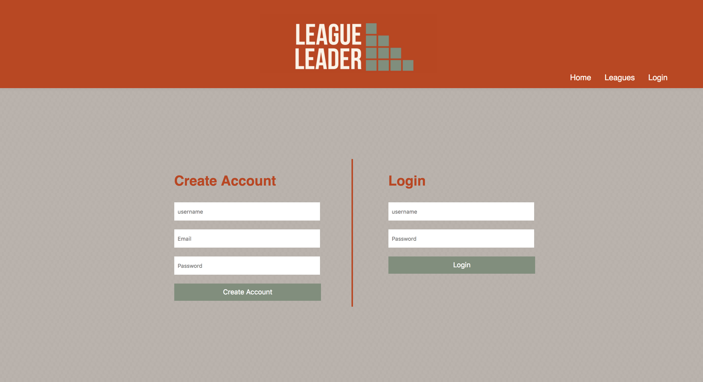
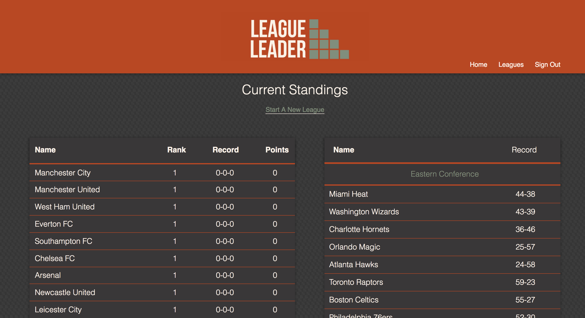
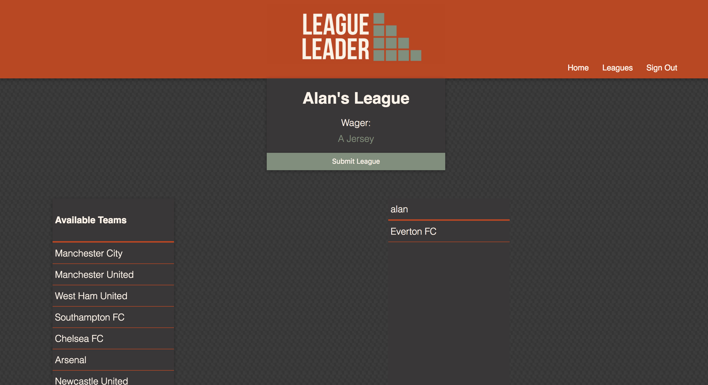

# League-Leader

League-Leader is an app designed to make betting with friends much easier to do. Users have the ability to log in, pick a sport and draft teams. Users will soon have the ability to invite other users and hold multi-person live drafts. The App is built with React, Redux, and Router on the frontend and node, express, and knex on the backend. 


## Getting Started

These instructions will get you a copy of the project up and running on your local machine for development and testing purposes. See deployment for notes on how to deploy the project on a live system.


### Installing

A step by step series of examples that tell you have to get a development env running

Say what the step will be

```
Clone the repositorys (git clone https://github.com/abomb14c/league-leader) & (git clone https://github.com/abomb14c/league-leader-backend).
```
```
# get backend server running first
```
npm install 
node server.js
```

# get frontend server running
npm install
```
```
npm start
```

## Running the tests

In the terminal, 

```
npm test
```

## Built With

* [Creat-React-App](https://github.com/facebook/create-react-app) - The web framework used

## Authors

***Alan Charles** - *Initial work* - [abomb14c](https://github.com/abomb14c)
